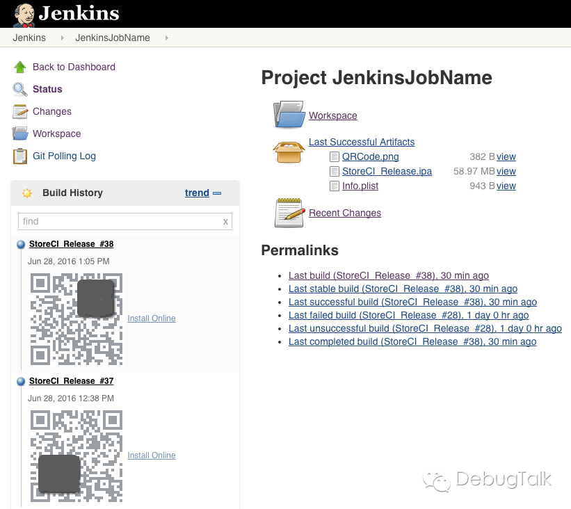
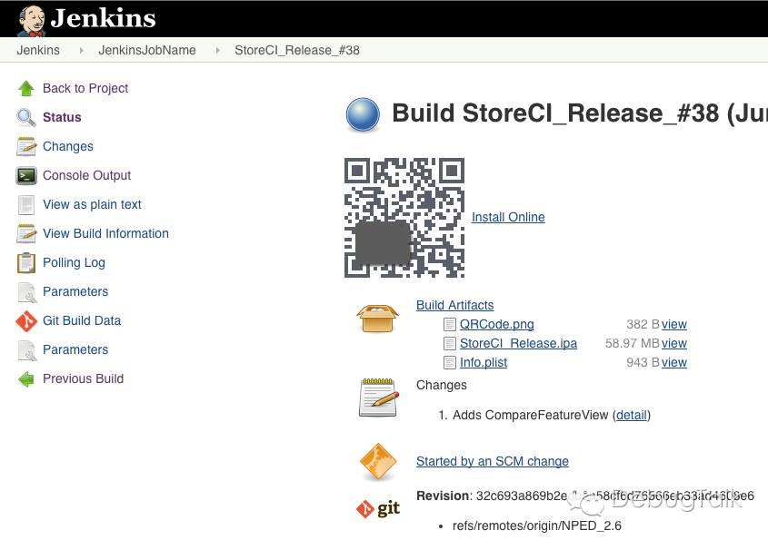

## Overview

**Jenkins job overview:**



**Jenkins job build page view:**




## 开箱即用

**1，添加构建脚本；**

- 在构建脚本中配置`PROVISIONING_PROFILE`和`pgyer/fir.im`账号；
- 在目标构建代码库中，创建`Build_scripts`文件夹，并将`build.py`拷贝到`Build_scripts`中；
- 将`Build_scripts/build.py`提交到项目中。

除了与Jenkins实现持续集成，构建脚本还可单独使用，使用方式如下：

```bash
$ python ${WORKSPACE}/Build_scripts/build.py \
	--scheme ${SCHEME} \
    --workspace ${WORKSPACE}/Store.xcworkspace \
    --configuration ${CONFIGURATION} \
    --output ${WORKSPACE}/${OUTPUT_FOLDER}
```

**2、运行jenkins，安装必备插件；**

```bash
$ nohup java -jar jenkins_located_path/jenkins.war &
```

**3、创建Jenkins Job；**

- 在Jenkins中创建一个`Freestyle project`类型的Job，先不进行任何配置；
- 然后将`config.xml`文件拷贝到`~/.jenkins/jobs/YourProject/`中覆盖原有配置文件，重启Jenkins；
- 完成配置文件替换和重启后，刚创建好的Job就已完成了大部分配置；
- 在`Job Configure`中根据项目实际情况调整配置，其中`Git Repositories`是必须修改的，其它配置项可选择性地进行调整。

**4、done！**

## Read More ...

- [《使用Jenkins搭建iOS/Android持续集成打包平台》](http://debugtalk.com/post/iOS-Android-Packing-with-Jenkins)
- [《关于持续集成打包平台的Jenkins配置和构建脚本实现细节》](http://debugtalk.com/post/iOS-Android-Packing-with-Jenkins-details)
- 微信公众号：[DebugTalk](http://debugtalk.com/assets/images/wechat_qrcode.png)
